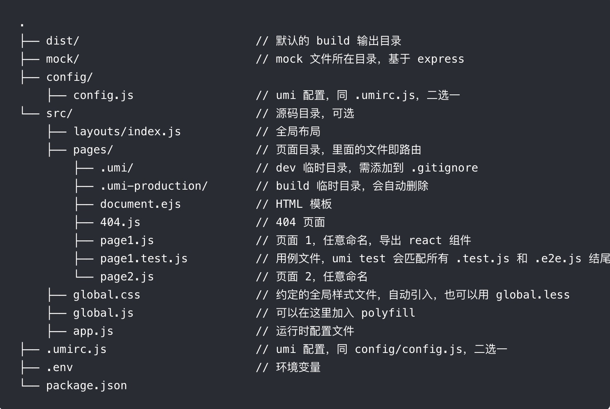

# dva-todolist
umi + dva todolist 
- 项目参考：https://github.com/sorrycc/blog/issues/62
- 官方文档：https://umijs.org/zh/guide/#%E4%BB%8B%E7%BB%8D

# 创建项目
  [创建 umi 项目](https://umijs.org/zh/guide/create-umi-app.html#%E4%BB%8B%E7%BB%8D-create-umi)
  

# 项目启动和部署github

1.安装gh-pages 
```javascript
npm install gh-pages --save-dev
```
2.package.json 添加     
```javascript
  "homepage":"https://xuwenliu.github.io/umi-todolist",
```
3.package.json script里面 添加     
```javascript
"predeploy": "yarn build",
"deploy": "gh-pages -d dist" //dist 为npm run build 打包后生成的文件夹名称
```
4.npm run build
5.npm run deploy
6.由于umi的默认配置是部署到根目录 参看 [部署](https://umijs.org/zh/guide/deploy.html)
  而我们部署到https://xuwenliu.github.io/umi-todolist 这个地址 后面多了 /umi-todolist
  所以需要 额外在.umirc.js里面配置:
```javascript
base: '/umi-todolist',
publicPath: '/umi-todolist/', //后面的斜杠必写
history: 'hash',
```


# 使用插件
- [dva-logger](https://github.com/afc163/dva-logger) 
 
1.安装npm install dva-logger --save-dev
2.修改src/app.js
```javascript
export const dva = {
	config: {
		onError(err) {
			err.preventDefault();
			console.error(err.message);
		},
	},
	plugins: [
		require('dva-logger')(),
	],
};

```
- [classnames](https://github.com/JedWatson/classnames)
- [dva-loading](https://github.com/dvajs/dva/tree/master/packages/dva-loading) 已经内置

# 如何访问到 store 或 dispatch 方法？

```javascript
window.g_app._store
window.g_app._store.dispatch
```
# 总结
  基本使用和dva如出一辙，不同之处是 
  [model的注册](https://umijs.org/zh/guide/with-dva.html#model-%E6%B3%A8%E5%86%8C)

  注意文档描述： 推荐开启 dva-immer 以简化 reducer 编写，
```javascript
export default {
  plugins: [
    [
      'umi-plugin-react',
      {
        dva: {
          immer: true
        }
      }
    ],
  ],
};
```
  若开启，则需要会使用[immerjs](https://immerjs.github.io/immer/docs/introduction) 
